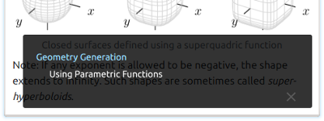

# MDviewer

MDviewer is a cross-platform and editor-agnostic previewer for Markdown files. You can use it with your favorite text editor and the Preview updates every time you save. In applications that automatically save in the background, the Preview will be updated at save intervals as you type.

MDviewer can also be configured to work with just about any syntax and processor you need, including Textile, reStructuredText, MediaWiki, AsciiDoc, Graphviz and more.


# Contents

- [Installation](#installation)
- [Configuration](#configuration)
    - [Configuration Files](#configuration-files)
    - [Setting a Markdown Processor](#setting-a-markdown-processor)
- [Basic Usage](#basic-usage)
    - [Opening Files](#opening-files)
    - [Navigating Preview](#navigating-preview)
    - [Choosing a Style](#choosing-a-style)
    - [Zooming In and Out](#zooming-in-and-out)
    - [Clicking External Links](#clicking-external-links)
    - [Searching](#searching)
    - [Exporting HTML](#exporting-html)
    - [Printing](#printing)
- [Advanced Usage](#advanced-usage)
    - [Adding Custom Styles](#adding-custom-styles)
    - [Using Math Formulas](#using-math-formulas)
    - [Evaluating Environment Variables](#evaluating-environment-variables)
- [Troubleshooting](#troubleshooting)
    - [Preview Not Updating](#preview-not-updating)
    - [Overall Performance Issue](#overall-performance-issue)
- [Acknowledgments](#acknowledgments)
- [Bugs](#bugs)
- [License](#license)

# Installation

MDviewer requires the following packages to run:

- [Python 3][python] and [PyQt5][pyqt5] libraries
- Markdown (or other markup) processor

To install Python 3 and PyQt5 on Debian-based systems such as Ubuntu or Mint, you can issue the following command:

```shell
sudo apt-get install python3 python3-yaml python3-pyqt5
```

The current MDviewer version is based on Qt WebKit browser engine, which is dropped from the release since Qt 5.6 and must be installed separately:

```shell
sudo apt-get install python3-pyqt5.qtwebkit
```

To install and configure Markdown (or other markup) processor see the [Setting a Markdown Processor](#setting-a-markdown-processor) section below.

# Configuration

## Configuration Files

MDviewer stores all of its configuration data in YAML files which have the `.yml` extension and use the UTF-8 encoding.

By default, MDviewer checks the following places for configuration files, in the following order:

- `$HOME/.config/mdviewer/settings.yml` on macOS and GNU/Linux or `%APPDATA%\mdviewer\settings.yml` on MS Windows
- `settings.yml` in the application's root directory

In general, you should place your personal settings in `$HOME/.config/mdviewer/settings.yml` (or `%APPDATA%\mdviewer\settings.yml`), so they will be preserved between software updates.

## Setting a Markdown Processor

First, you must specify a Markdown (or other markup) processor in the `processor_path` field of the configuration file. Enter a full path to an executable or script which can return HTML or SVG output on STDOUT and it will be used for Preview and Save operations. Examples of cross-platform Markdown processors include [pandoc][pandoc], [MultiMarkdown][multimarkdown], and [PHP Markdown Extra][php-markdown-extra].

If the specified processor needs additional arguments besides the file name, specify them in the `processor_args` field, separating each argument with a space, just like you would on the command line. If your process is more complicated than a single command, create a self-contained script, make it executable and point the processor setting to it. In your scripts you can use the MDviewer-specific environment variables as described in the [Evaluating Environment Variables](#evaluating-environment-variables) section.

Configuration file entry example:

```yaml
processor_path: /usr/bin/pandoc
processor_args: --from=markdown --to=html5 --standalone
```

# Basic Usage

## Opening Files

You can open files directly using the "File > Open" menu option. If a file is currently being displayed it will be closed. Alternatively, you can give the path and name of a particular file as a command-line argument to open that file immediately upon viewer's startup:

```shell
mdviewer file.md
```

## Navigating Preview

There are multiple ways to navigate the Preview window. You may use the scrollbars, your mousewheel or the Up Arrow and Down Arrow keys to scroll the viewing area. In addition to the Page Up and Page Down keys you can also use the Vim shortcuts "j" and "k" to move one page down and up.



Pressing the "t" key will toggle the Navigation pane showing the Table of Contents, and clicking the title of a heading will navigate to that section of the Preview.

## Choosing a Style

You can select a preview and print style in the "Style" drop-down menu. You can add your own styles as described in the [Adding Custom Styles](#adding-custom-styles) section.

## Zooming In and Out

You can increase or decrease the magnification of the document view using the "View" menu options.

Depending on the selected style zooming will change the size of everything on the Preview, including text and images, or just the size of the font.

## Clicking External Links

Clicking an external link in your document's Preview will open it in your default web browser. If the link points to a local file then it will be opened with a suitable application instead of a web browser.

The user's desktop settings control whether certain executable file types are opened for browsing, or if they are executed instead. Some desktop environments are configured to prevent users from executing files obtained from non-local URLs, or to ask the user's permission before doing so.

## Searching

The search bar on the bottom of the viewing area can be accessed with the "File > Find" menu option and allows you to incrementally search through the Preview for a word or phrase. Once you search, you can use the "Next" and "Previous" buttons on the right side of the search bar to navigate forward and backward through additional results.

The checkboxes on the left side of the search field allow you to narrow the search down by case sensitivity and wrap the search around the document boundaries. Clicking the "Done" button will hide the search bar.

## Exporting HTML

The "File > Save HTML" menu option will allow you to save a full HTML document ready for sharing or publishing.

## Printing

The "File > Print" menu option will bring up a standard print dialog. Here you can select a printer and set available printing options. The Preview will be printed based on the currently selected style. Each preview style has its own accompanying print style which modifies type sizes and colors, and displays external links.

You can save the Preview as paginated PDF by choosing "Print to File (PDF)" in the drop-down list of available printers.

# Advanced Usage

## Adding Custom Styles

If you're familiar with CSS, you can create your own style sheets and copy them to the MDviewer's `stylesheets` directory. CSS files should have the `.css` extension and use the UTF-8 encoding. New styles will be added to the "Style" drop-down menu and named based on the CSS file name.

All CSS3 options that work in WebKit will work in MDviewer. See the existing style sheets in the application's `stylesheets` directory for details.

Tip: Use the Web Inspector to see what elements and attributes exist and what CSS rules are applying to them. You can launch the Web Inspector by selecting "Inspect" in the context menu.

Note: Import of existing CSS files in custom style sheets using the `@import` rule currently has a drawback that you will need to reload the Preview (by pressing F5 or selecting "Reload" in the context menu) first time after selecting the custom style sheet to evaluate the importing step.

## Using Math Formulas

You can use [MathJax][mathjax] JavaScript library to render inline and displayed LaTeX equations embedded in your documents.

To install MathJax on Debian-based systems such as Ubuntu or Mint, all you need to do is

```shell
sudo apt-get install libjs-mathjax
```

On UNIX-like systems where MathJax is not packaged, you can download it from [GitHub][mathjax-github] and extract to `/usr/share/javascript/` directory.

Alternatively, you can use a third party CDN server, where the JavaScript needed for MathJax to work will be loaded at run time. This simplifies the installation and ensures the latest version of the library is always used, but requires an Internet connection at run time.

To enable MathJax support you have to point your processor or your document template to the `MathJax.js` load script. The exact way depends on your processor (see the [Setting a Markdown Processor](#setting-a-markdown-processor) section). E.g., in case of MultiMarkdown you can add following metadata directly to your Markdown document:

```text
html header: <script type="text/javascript"
    src="/usr/share/javascript/MathJax/MathJax.js?config=TeX-AMS-MML_HTMLorMML">
    </script>
```

Pandoc provides the `--mathjax[=URL]` command-line option. The URL should point to the `MathJax.js` load script. If an URL is not provided, a link to the Cloudflare CDN will be inserted.

```shell
pandoc --from=markdown --to=html5 --standalone \
       --mathjax='/usr/share/javascript/MathJax/MathJax.js?config=TeX-AMS-MML_HTMLorMML'
```

MathJax supports most of the standard TeX and LaTeX math syntax, as well as some AMS and other LaTeX extensions and custom macros. See [MathJax TeX and LaTeX Support][mathjax-tex] page for details. In the MDviewer's `extras` directory you can find an example of local configuration file for MathJax v2, which you can use as a starting point for your own configuration.

Please note that MathJax doesn't provide a full LaTeX environment. Only math-mode macros are supported.

## Evaluating Environment Variables

MDviewer runs the processor in its own shell, meaning standard environment variables are not automatically passed. You can use MDviewer's environment variables to augment your own in your scripts. MDviewer makes the following variables available for use in your shell scripts:

- `MDVIEWER_FILE`: The name of the file being viewed
- `MDVIEWER_EXT`: The extension of the file being viewed
- `MDVIEWER_ORIGIN`: The location (base directory) of the file being viewed

These variables allows you to script different processes based on the type and location of file being viewed. For example, on a UNIX-like system you can create a shell script `mdviewer-proc.sh`

```shell
#!/bin/sh

case "$MDVIEWER_EXT" in
    md | markdown | text )
        pandoc --from=markdown --to=html5 --standalone "$1" ;;
    rst | rest )
        pandoc --from=rst --to=html5 --standalone "$1" ;;
    dot )
        dot -Kdot -Tsvg "$1" ;;
    html | htm | svg )
        cat "$1" ;;
    * )
        echo "Unknown format: $MDVIEWER_EXT" >&2 ;;
esac
```

make it executable and point the processor setting to it:

```yaml
processor_path: mdviewer-proc.sh
processor_args: ""
```

# Troubleshooting

## Preview Not Updating

Some text editors will save by writing to an alternate file and then renaming it over the original one. The original file is removed when the new file has been successfully written. Because the original file is deleted, MDviewer will get confused and stop watching the file.

Many editors can be configured to update existing file in place when saving instead of replacing it. Below some configuration tips for popular programming editors.

- **Vim**

     Add following line to your `.vimrc` configuration file:

    ```vim
    set backupcopy=yes
    ```

- **GNU Emacs**

    Add following line to your `.emacs` configuration file:

    ```elisp
    (setq backup-by-copying t)
    ```

- **Sublime Text**

    Add following line to your `Preferences.sublime-settings` configuration file:

    ```json
    "atomic_save": false
    ```

## Overall Performance Issue

The rendering performance can vary greatly based on your configuration settings and the document content. There are several factors that can affect rendering speed:

- **Document processor**

    Different processors have different performance, which depends on the type of content you have in your document.

- **Documents containing a lot of math expressions**

    The math rendering performance generally depends on the [MathJax][mathjax] configuration, especially the output processor options. Depending on type and complexity of your math you may consider using [KaTeX][katex] with [Auto-render][katex-autorender] extension as an alternative solution.

# Acknowledgments

- Copyright 2013 Matthew Borgerson <mborgerson@gmail.com>
- Copyright 2014 Vova Kolobok <vovkkk@ya.ru>

# Bugs

MDviewer is developed and tested primarily to work on GNU/Linux and other POSIX-compatible platforms. If you find any bugs in MDviewer, please construct a test case or a patch and open a ticket on the [GitHub issue tracker][github-issues].

# License

This program is free software; you can redistribute it and/or modify it under the terms of the GNU General Public License as published by the Free Software Foundation; either version 3, or (at your option) any later version.

This program is distributed in the hope that it will be useful, but WITHOUT ANY WARRANTY; without even the implied warranty of MERCHANTABILITY or FITNESS FOR A PARTICULAR PURPOSE. See the GNU General Public License for more details.

You should have received a copy of the GNU General Public License along with this program. If not, see <http://www.gnu.org/licenses/>.

[python]: https://www.python.org/downloads/

[pyqt5]: https://riverbankcomputing.com/software/pyqt/download5

[pandoc]: https://pandoc.org/

[multimarkdown]: http://fletcherpenney.net/multimarkdown/

[php-markdown-extra]: https://michelf.ca/projects/php-markdown/extra/

[mathjax]: https://www.mathjax.org/

[mathjax-github]: https://github.com/mathjax/MathJax

[mathjax-tex]: http://docs.mathjax.org/en/latest/input/tex/index.html

[katex]: https://katex.org/

[katex-autorender]: https://katex.org/docs/autorender.html

[github-issues]: https://github.com/saf-dmitry/mdviewer/issues

